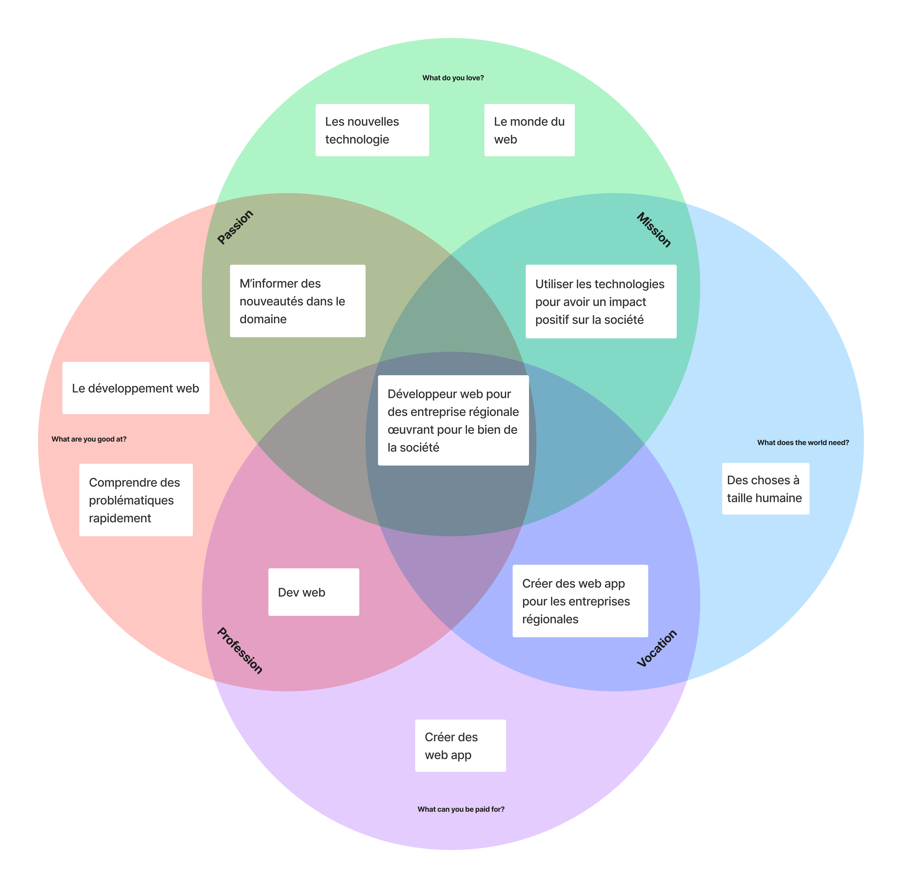

+++
title = "A propos"
date = "2023-01-31"
[ author ]
  name = "Simon Meia"
+++

## Contexte

Ce site est le fruit d'un cours du 5ème semestre de bachelor d'ingéniérie des médias nommé Laboratoire de veille technologique. Le but de ce cours était de mettre en place un système d'écoute de veille technologique basé sur un domaine dans lequel nous voulons nous investir professionnellement.

## Ikigai

Après avoir obtenu un CFC d'informaticien avec une spécialisation pour le développement d'applications, j'ai décidé de me réorienté légèrement en quittant l'informatique "bas niveau" pour me spécialisé dans le développement web. Cette passion pour le développement web se retrouve dans mon ikigai et traduit bien mon envie d'en faire mon métier.

## Fiche de domaine

La fiche de domaine à été réalisé avant de réelement commencer à veille, elle à ensuite été afinée durant le processus de veille pour pouvoir classer au mieux les ressources trouvées.

| Domaine | Développement front-end |
| --- | --- |
| Sous-domaines | Outil, Repository, Ressource, Guide, Vulgarisation, Framework, UI, Statistiques |
| Mots-clés | HTML, CSS, Javascript, Typescript, React, Vue, Animation, Icones, Eco-Design, Listes, SEO, Standards, WordPress, Code Snippets, Formation, Gaming, Rollback netcode, Generator, Loader, Idées, Design, Tree.js, 3D,  |
| Pourquoi ? | Le développement web est ma passion et c'est dans cette direction que je veux orienter ma carrière professionnelle |