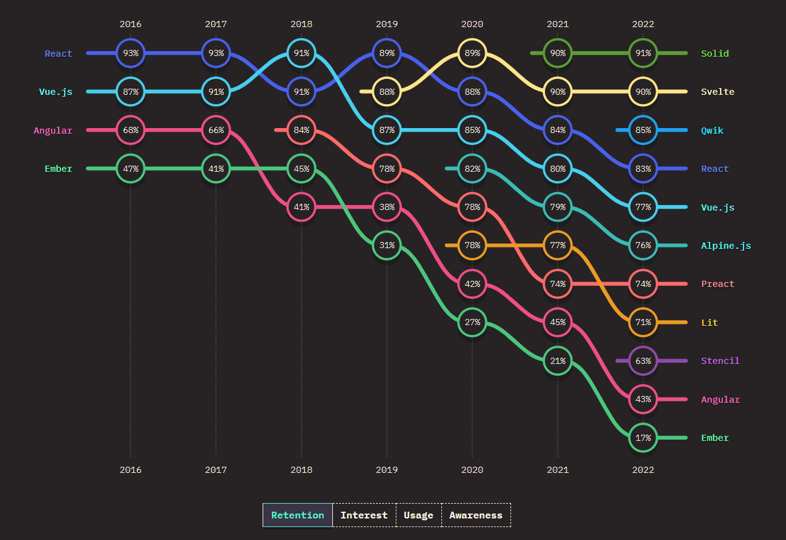
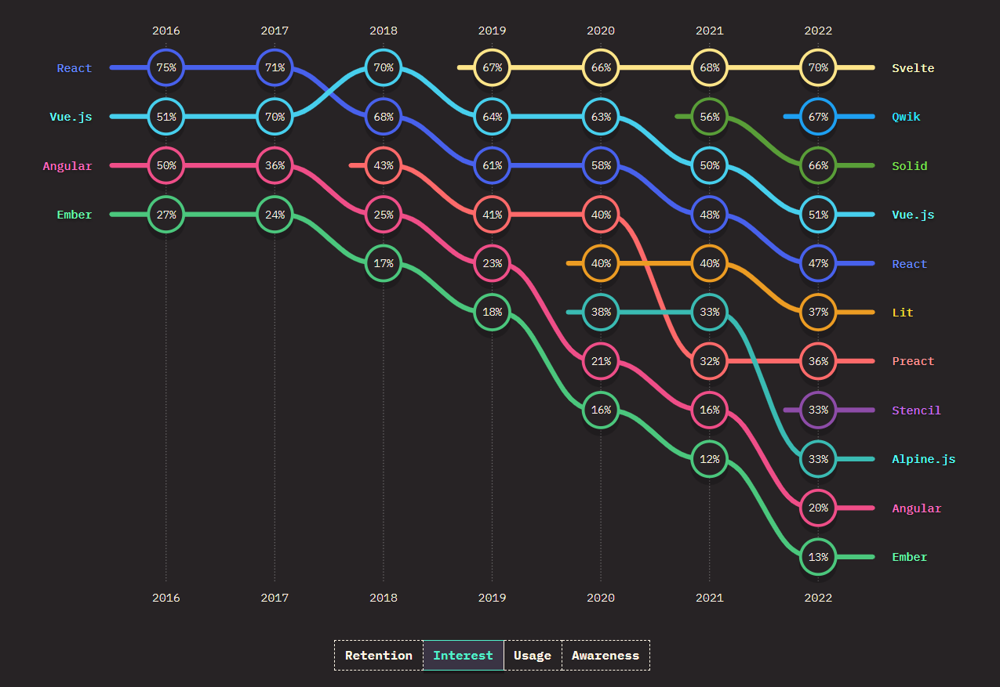
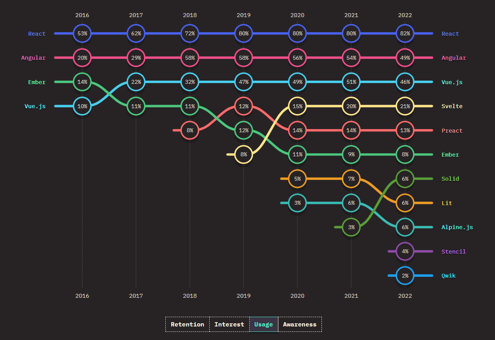
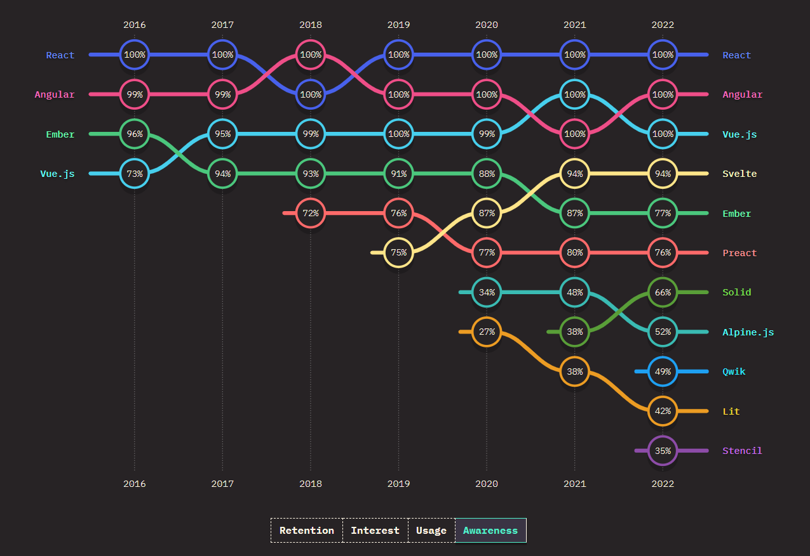

+++
categories = ["Front-end"]
date = "2023-01-16"
description = "Analyse de l'utilisation des frameworks javascripts en 2022"
linktitle = ""
title = "The State of JS | Front-end framework"
slug = "state-of-js-frontend-framework"
type = "post"
+++

## Introduction

Comme chaque année, [stateofjs.com](https://2022.stateofjs.com/en-US/) a publié les résultats de son sondage portant sur l’utilisation du Javascript. Parmi les graphiques présentés, nous allons nous intéressé dans cet article plus particulièrement aux [frameworks front-end](https://2022.stateofjs.com/en-US/libraries/front-end-frameworks/#front_end_frameworks_experience_ranking) en analysant aussi bien que possible l’onglet **ranking** du tableau **ratio over time**.

>💡 Avant tout, il est important de définir les termes qui seront utiliser dans la suite de l’article :
> - **Satisfaction** : utiliserait à nouveau / (utiliserait à nouveau + n'utiliserait pas à nouveau)
> - **Intérêt** : veut apprendre / (veut apprendre + pas intéressé)
> - **Utilisation** : (utiliserait  à nouveau + n'utiliserait pas à nouveau) / total
> - **Awareness** : (total - jamais entendu) / total

## Les tendances actuelles
Dans un premier temps, on peut remarquer que le graphique de la satisfaction et de l’intérêt sont très similaires. Les piliers comme React et Vue sont en train de perdre des places doucement année après année dans l'estime des développeurs. Phénomène encore accéléré pour Angular qui est en chute libre depuis plusieurs années.

Front-end framework : Satisfaction

Front-end framework : Intérêt

## La loi des plus forts

Dans l'autre opposé des deux graphiques, on peut voir que des frameworks plus récents comme Svelte, Qwik ou Solid sont très appréciés par la communauté front-end.

Paradoxalement à ces deux résultats, les graphiques d'utilisation et d’awareness montrent que malgré un intérêt et une satisfaction diminués au fil des années, les trois géants React, Angular et Vue sont indétrônables depuis des années. On peut notamment mentionner React qui a 80 % d'utilisation comparé à ses deux concurrents directs qui stagnent aux alentours de 50 %.

Front-end framework usage

Front-end framework awareness

## Svelte, le prochain leader ?

Même si le haut de tableau de l’utilisation est occupé par des librairies bien établies depuis des années qui souffrent peu, pour l'instant, des avis de plus en plus négatifs des développeurs, il y a peut-être un de leurs concurrents qui pourrait faire bouger les choses en 2023.

A la première place du graphique de l’intérêt depuis 4 ans, et oscillant entre la première et la deuxième place de du graphique de la satisfaction depuis également 4 ans, Svelte de sûr un des frameworks les plus appréciés de ces dernières années. De plus, contrairement à Solid ou Qwik, il n’a pas seulement gagné en intérêt et satisfaction mais aussi en nombre d’utilisateurs. Passant de 8% à 21% d’utilisation en 4 ans il est actuellement le 4ème framework le plus utilisé par les développeurs front-end.

Bien que l'avenir reste incertain, Svelte semble être le prochain leader à surveiller de près dans les années à venir et pourrait être une technologie dans laquelle il serait judicieux d'investir du temps pour s'y familiariser.
